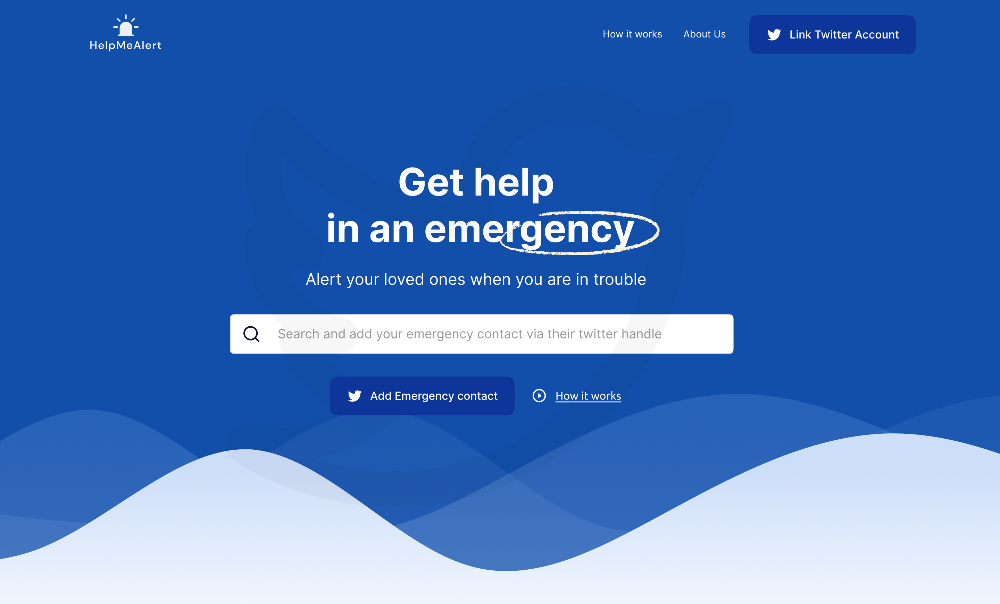

  <h3 align="center">HelpmeAlert</h3>

  

   A Safety emergency tool you can use on the Twitter platform to notify your emergency contacts of your situation.
     
    <a href="https://twitter.com/helpmealert"><strong>Check it out »</strong></a>
     
     
    <a href="https://helpmealert.vercel.app/">View Website</a>
    ·
    <a href="https://github.com/Young-Einstein10/helpmealert/issues">Report Bug</a>
    ·
    <a href="https://github.com/Young-Einstein10/helpmealert/issues">Request Feature</a>
  

## Inspiration

With the increased rate of insecurity, theft, and banditry we are currently experiencing in Nigeria, Safety has become a luxury. This inspired us to take advantage of the community we have on Twitter to help notify our loved ones in case of any emergency.

`HelpmeAlert` aims to be the go-to app on Twitter whenever anyone is in an emergency.

## What it does

Your very first tweet to our handle `@helpmealert` would provide you a link to set up your emergency contacts.

During an emergency, you would tweet at our handle `@helpmealert` and your loved ones will be notified of your current emergency situation.

## How we built it

- We began by making some research to discover how people would most likely behave in an emergency. Then we created a flow to onboard users and also notify their emergency contact whenever our handle is tweeted at.

- We created a landing page design in **Figma** and a profile section that users can use to view more details about the app and manage their emergency contacts.

- We implemented the design in code using **NextJS** and **Typescript** for the frontend and leveraged **NodeJS** for the backend due to its flexibility and performant streaming capabilities.

- **Prisma ORM** was used in interacting with our database due to its ease and speed of querying our **PostgreSQL database** for any data we needed.

- Due to the fact that users would need to be authenticated before they can use the app, we made use of the **Twitter Authentication API** in authenticating users before they can begin adding any contacts to their profile.

- Usability testing with real humans was also done in order to optimize the performance and user flow of the app.

## Challenges we ran into

- One major challenge we faced during development was identifying the specific API endpoint needed that will aid in achieving the kind of flow we were trying to build. We spent a considerable amount of time filtering through Twitter's API Documentation to know which would be useful in our case.

- Choosing a name for the app was surprisingly a problem we had to solve because we wanted the name of the app to be descriptive enough of the kind of help it provides as well as something users would find easy to remember, and relate with as well as being very symbolic. Eventually, we settled for `HelpmeAlert` as the name due to the fact that it's a common word everyone says whenever they need some kind of help or assistance.

## Accomplishments that we're proud of

We were able to create a working prototype for the said objective which we wanted to achieve for the app. Users can easily tweet at our handle, `@helpmealert`, and they get a reply with a link to begin the process of setting up their emergency contacts connected to the Twitter platform.

## What we learned

- Being proactive and prepared is a necessity everyone should take seriously. Emergency situations do not give notice of them happening, that's why they are known as emergencies.

- There is a need to have specific response units for different types of emergencies and users feel much safer when they know a community has their back in a time of an emergency.

## What's next for HelpmeAlert

- Next steps would be implementing different keywords to help us streamline and identify the type and level of emergency.

- Implementing a word filter in order to filter out spam and other sensitive contents that may be tweeted at our handle.

- Automatically alerting the necessary emergency bodies that are related to a user's emergency.

- Preventing or detecting false alerts and penalization for misuse of the app

## Implementation

- [Frontend](./client)
- [Backend](./server)
